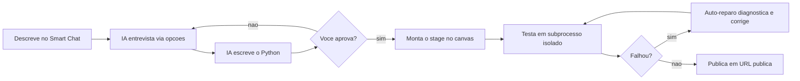
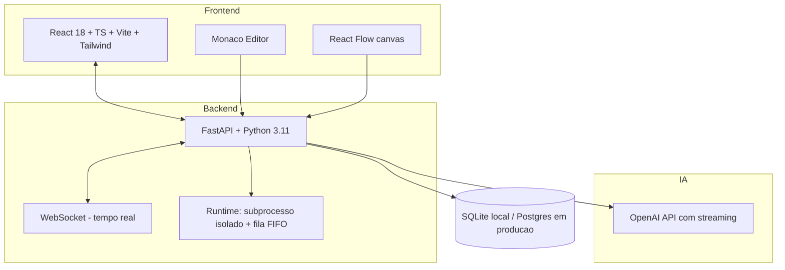

<div align="center">

# FlowDesk

### Automação de processos em linguagem natural. Você descreve, a IA constrói.

Descreva o que quer automatizar. Um agente de IA entrevista, escreve o Python,
monta o fluxo num canvas visual e publica como aplicação web. Sem sair do navegador.


</div>

---

## O problema

Times de negócio sabem exatamente o processo que precisam automatizar, mas dependem de um engenheiro para transformar isso em software. A fila de TI é longa, o processo simples espera semanas, e quando fica pronto já mudou. Ferramentas low-code tradicionais esbarram no primeiro caso que sai do padrão.

## A ideia

A linguagem natural é a interface. Você descreve a automação no chat; a IA faz as perguntas certas, escreve e testa o Python, e monta o fluxo num canvas. O time técnico mantém controle total do código gerado; o time de negócio publica sozinho.

> Você: *"toda segunda, pegar a planilha do SharePoint, conciliar com o banco e mandar as divergências por e-mail"*
>
> FlowDesk: entrevista rápida → gera o script → monta Form → Script → Job → publica a URL

---

## Como funciona



Cada etapa do fluxo é um **stage** executável: `Form` (entrada), `Script` (lógica), `Job` (agendamento), `Hook` (webhook) ou `Agent` (IA). O modelo de stages é inspirado no da Abstra (abstra.io).

---

## Módulos

| Módulo | O que faz |
| --- | --- |
| Console | Painel admin com cards de projetos, pastas e gerenciamento |
| Editor | Três painéis: Smart Chat, editor Monaco e canvas React Flow |
| Monitor | Visualiza execuções em tempo real, stage a stage |
| Histórico de versões | Tabela de builds imutáveis |
| Logs de execução | Filtragem e rastreamento completo |
| Sistema de arquivos | Uploads, processamento e outputs |
| Controle de acesso | Gestão de usuários e papéis |
| Aplicação publicada | Interface do usuário final com SSO e formulários |
| Auto-reparo | Diagnóstico e correção assistida de scripts que falharam |

---

## Arquitetura



- Scripts executam em **subprocesso isolado**, com fila FIFO e logs capturados em tempo real via WebSocket.
- A IA usa OpenAI API com streaming, com fallback para modo simulado quando a chave não está configurada.

---

## Stack

- **Backend:** FastAPI, Python 3.11, SQLAlchemy, WebSocket nativo
- **Frontend:** React 18, TypeScript, Vite, Tailwind CSS
- **Editor de código:** Monaco Editor
- **Canvas de workflow:** React Flow
- **IA:** OpenAI (gpt-4o-mini por padrão)
- **Autenticação:** JWT
- **Banco:** SQLite local, Postgres/Supabase em produção

---

## Estrutura do repositório

```
back/     API FastAPI, runtime e integracao de IA
front/    Aplicacao React (console, editor, canvas)
docs/     Documentacao tecnica
testes/   Suite de integracao (qa_suite.py)
```

---

## Execução local

```bash
# Backend (porta 8000)
cd back
uvicorn app.main:app --reload --reload-dir app

# Frontend (porta 5173, com proxy para a API)
cd front
npm install && npm run dev
```

> Use `--reload-dir app`. Sem isso, o runtime recarrega o servidor ao reescrever scripts em `storage/`.

A suíte de integração (`testes/qa_suite.py`) exercita todos os módulos contra o servidor real.

---

## Roadmap

- [x] Modelo de stages (Form, Script, Job, Hook, Agent)
- [x] Smart Chat com codegen assistido por IA
- [x] Runtime isolado com logs em tempo real
- [x] Auto-reparo de scripts
- [ ] Publicação em Postgres/Supabase gerenciado
- [ ] Biblioteca de templates de automação
- [ ] Permissões granulares por projeto

---

## Sobre

Projeto de [Marcelo Brasiliense](https://github.com/Marcelo-Brasiliense-RJ) · [Portfólio](https://portifolio-marcelo-brasiliense.vercel.app/)

<div align="center">

Da descrição em linguagem natural ao app publicado.

</div>
